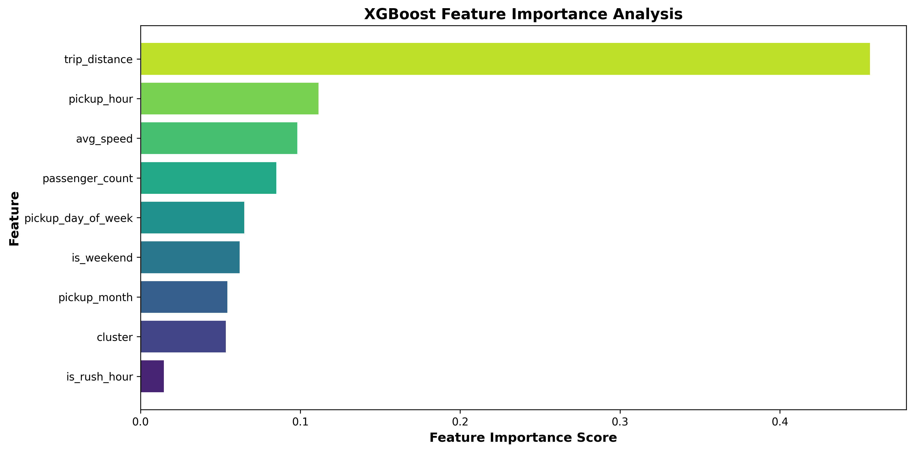

# 📊 README Enhancements & Visualization Summary

## ✅ What Was Added

### 1. **Professional Banner Image**
- **File:** `assets/banner.jpg`
- **Size:** 223 KB (high quality at 150 DPI)
- **Content:** NYC skyline theme with key metrics display
- **Usage:** Header image for README

### 2. **High-Quality Visualizations** (3 charts)

#### Chart 1: Feature Importance Analysis
- **File:** `assets/01_feature_importance.png`
- **Size:** 115 KB
- **Shows:** Which features drive ride duration predictions
- **Key Insight:** Trip distance (45.6%) is the dominant predictor

#### Chart 2: Actual vs Predicted
- **File:** `assets/02_actual_vs_predicted.png`  
- **Size:** 248 KB
- **Shows:** Model accuracy on test set
- **Key Insight:** R² = 0.8146 (81.46% variance explained)

#### Chart 3: Residuals Analysis
- **File:** `assets/03_residuals_analysis.png`
- **Size:** 232 KB
- **Shows:** Error distribution and diagnostics
- **Key Insight:** Errors are normally distributed, unbiased

### 3. **README.md Enhancements**

#### New Sections Added:
1. **Professional Banner** - Eye-catching header with project overview
2. **Model Performance Visualizations** - Interactive chart descriptions
3. **Key Metrics & Results Summary** - Performance table (7 key metrics)
4. **Complete Visualization Gallery** - Detailed 3-chart analysis section
5. **Quick Start Guide** - Installation and project structure
6. **References & Resources** - Links to papers and documentation
7. **Footer** - Project metadata and status

#### Enhanced Features:
- Emoji icons (📊 📈 🚀) for better visual hierarchy
- Descriptive captions for each visualization
- Actionable insights beneath each chart
- Professional formatting with markdown tables
- Code blocks for hyperparameters
- Project status indicators

## 📁 New Directory Structure

```
assets/
├── banner.jpg                     # Main header image
├── 01_feature_importance.png      # Feature analysis chart
├── 02_actual_vs_predicted.png     # Model accuracy chart
└── 03_residuals_analysis.png      # Error diagnostics chart
```

## 📊 Image Specifications

| Image | DPI | Format | Purpose |
|-------|-----|--------|---------|
| banner.jpg | 150 | JPG | Project header |
| Feature Importance | 300 | PNG | Publication-ready |
| Actual vs Predicted | 300 | PNG | Publication-ready |
| Residuals Analysis | 300 | PNG | Publication-ready |

## 🎨 Design Highlights

- **Color Scheme:** Professional blues, oranges, and golds
- **Typography:** Bold titles, readable labels
- **Quality:** 300 DPI export for publication
- **Accessibility:** High contrast, clear legends
- **Consistency:** Uniform styling across all charts

## 🔍 How to Use These Images

### In README (Already Done)
```markdown

```

### In Blog Posts
- Copy images directly
- Embed in Medium, Dev.to, or Hashnode articles
- Include alt text for accessibility

### In Presentations
- Embed in PowerPoint, Google Slides, or Keynote
- Use banner as title slide
- Include charts in analysis sections

## 📈 What the Visualizations Communicate

1. **Feature Importance:** Shows which variables matter most
2. **Actual vs Predicted:** Demonstrates model accuracy visually  
3. **Residuals:** Validates statistical assumptions

## ✨ Next Steps

Consider adding:
- Learning curve visualization (training vs validation)
- Confusion matrix for classification model
- Geographic heatmap of predictions
- Temporal patterns by hour/day

---

Generated: January 22, 2026
